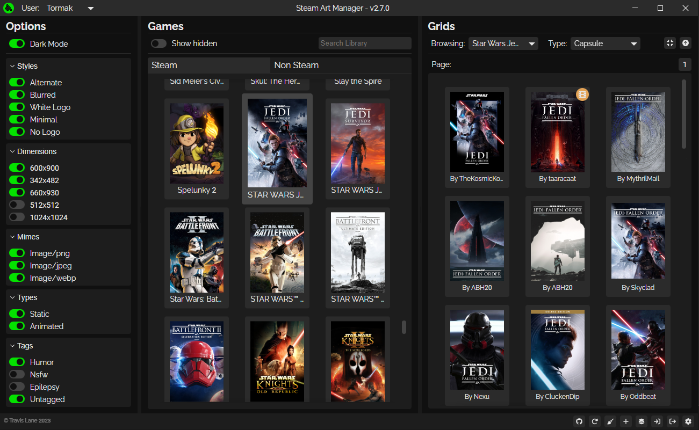

![SARM Badge](https://img.shields.io/badge/-SARM-lightgrey?color=555555&logo=data:image/png;base64,iVBORw0KGgoAAAANSUhEUgAAACAAAAAgCAYAAABzenr0AAAGOElEQVR42p1XS4wURRj+qnpm9gGyLxSiJ4waWITFA0YTNVFcIYIPPGk0+EqMV403L1w8aEiIjxgOqIRIJMYgRjHCgiZq4skEJFkgkKASec6+Z2d3dme6/P6/qmd7ZmfZherUdE93VX3/u74ymKsZXhGvMi9pd2C57cVm8zCewEr0mGW4HTks1m9TKLgruIhTOO5+Q198FIfwHy7rtwyvCi/Ha8FNgBM5VmNl9DF2Z05jMDMAl8mzX2K/wP5v6BfCu4HQT2HQfoTdMrfRmrV61jeRWLTOwdrt2GFfw1to5fth9jI18c1yVO1cp1eseuYIdgvvRSD+HDvj7XiHVoqra88pQBhg7sYK+wV+MOvQjQG+n+bbdi7qwnj5LagYjZuIImaPuF4X/x5Hf/wKtrhzOF8vhJkF3oOe6AB+Rxv9O0K5LbJYAuOOUJudQf23OfHxeYRIRJnm1UabjKBQeQ4PuRM4kRbCVP1Dic1dWBEdxl9YRPAiJwo4zc9JqPTWhckxjQ9gcl4hxHXTXCeLcQqxCWvdWVoiYFqNdjGX+JxmV80FPMMJMSe3UICvg7nu8V1V28+fTl18/iZrFdUSi+0eYhBLMYltk+iUgDP30edidpmQ2Idh54aCAG+wv+6f4718/xUflmmMLEwIrk0XdwtWYnmrfu/GSo12CbhsAE9HajCxyaVelijbyxTiWz7ftkAhZG1iCJamKLF1afMm06RVtS03Sk0Xh/sf7HuqGmmrbLshIYxiEMsKpr5ghcscRT8jvYOfnMZE0iTr23l7lSAHa1dqaWmBiQyKhaIuE+3l1K18vKqaXi8vnNaQMQyVN9AddgM2U/oOer5SA54I0KyFZUbrxB3GoLO9E02tTbpqZZtZmCUEQ7BuRQdL+5PWPILeasDVpo5GufuT91/8x1yUw6KWRV4R50t7V3sXmlubb1QIGQ7uKxstVmEdJZKXtgacpnenGO3PcNFrDlEuQlcnwZqbkcvltDcWIhUT5TkFsCKgkU0tcw6jaGLlTvYqCTgq6c4IOO+M2kxTBks7liKKIgW11uo9ESCx7MDwACaLkz7DvuS7p/gwqOnW2AoljBnuZnHVAS74eYTuZ6l1F/m3meDtM+DXDXHGRX4wj9JEyQuxf96S7eysoOMuFn8TwFtuDHxqagrl2NvdrPEdE40Se6ZZIRM1A+T5in/MZXPIZlmR43jurAouEfD8SB6VEpOph9p/77djNAW3NnIBsS2EyWRCfhofveYBP6Y4XsRYYUwtMBe4fCuVSgruppxqHf1MzE8Yg+s5po8Dl9YFpK8FEBZl3Wluj1l9GWuwjFKATTTNS94lw6PDKIwXVMt5we8l+FGCv8++I3j1RY79zmdVlc4IltQWUjhLDnckycuqaeg3+yH787OFSKJ/Fvhqr7lUzPiDEPnBcFJJccbvrOqOgOV+RZ+N+0ggr2FIaVTiBhkwTgE+nS2EAM8CX0usg75qxp/VBXXWuzU+6NNbSZtgXcWQO4ZDVtgr/XRAOVwlGMkESQt1QowNY2x8DBOTE8iPpsAPhMXHU2aub5PVIlcRLMF0CXOWrTFzmWz2H2W5cZXt/h3ug8zXF9QuNZ2c0bGQOZ17ln2E494N3+kttWkYGx3i92tc+7wfnzDmSPnZFRqkE23mUTzIIJyuUujEEoxgsyUUKdYHQ23t05xM6+jJYCKYmvXH3O/HuJMBmsFm32N/ls9DXHsZongXdpJR7RNsozXUqV8sg+gk63O3CpFJbapJgLb5LEk2KjX5dKrKuRB4zZ5H4hIFWsX7nVqShZJlcRr95cewRmk6sWtJKel49FOKlGbqdvZKADBBCNugyiVGbw1WmdRYmqbfPSndSFJ6Lk1KEYKP5hC2KtRZBpKgZDltKqX/zKYSpwRpVOFsqILDnDvONToCuNDy5GwQAj69BZdVCPJ2kZJFop/+ymlilpUruRoQzMN6Ys4Rzr2ca5xBv9LxujNBWqdEM398ymMw3oddLBxLzHoGZhuEvJpwNHNh9218NJM8z3J8h+YBHAOOhWir1poGR7PGLX04JWOOeNCUA2f18DnX4TQfvvMgKwfamzucphlG6nhuSF65t8vxvNcIi6o7nsumJvsKS/thFpkf3QKP5/8D383x4PbFkEIAAAAASUVORK5CYII=&style=flat-square)


[](#translations)

# Steam Art Manager
A tool for setting the artwork of your Steam library.



<br/>

## Features
 - Easily edit the art for your games
 - View the art available on SteamGridDB for your games
 - Upload custom images
 - Import and Export your art to a zip file
 - Clean out unused grid images easily

## Download and Install
To get the most recent release, head to the [latest release](https://github.com/Tormak9970/Steam-Art-Manager/releases/latest) and download the installer for your platform.

### For Windows:
 - **Downloading from GitHub**: Download the `steam-art-manager.msi` file, and run it to install SARM.
 - **Chocolatey (Under Review)**: run `choco install sarm`.

### For Linux:
  - **AppImage**:
    1. Download the `linux-installer.sh` bash script.
    2. Right click it, go to permissions, and mark it as executable.
    3. Double click the script to install SARM.

## How to use the app
When using Steam Art Manager, your workflow will typically be:
 - Open Steam Art Manager
 - Set your SteamGridDB api key (if you wish to browse images from SteamGridDB)
 - Wait for it to load your games
 - Go through your games, setting the art to whatever you choose
 - Save the changes

### Setting up the API key
If you want to use or browse images from [SteamGridDB](https://steamgriddb.com) you will need an api key (which is easy and free). To get one:
 1. Go to [SteamGridDB](https://steamgriddb.com), and sign in with Steam.
 2. Go to preferences, then API, and generate a new key if you don't already have one.
 3. Copy the api key.
 4. In Steam Art Manager, click the "Set API Key" button and paste the key in the text field and click "Save".

### Managing your art
For custom artwork:
 - Click the "Upload Your Own!" button and select your file.

For SteamGridDB:
 - Browse through the images that show up when you select a game, and select one. It will be saved in memory until you apply your changes, so you can do as many as you want at once!

### Exporting to a Zip
In order to export the zip, simply wait for your games to load, and click the "Export Zip" button, and choose a save location!

### Importing from a Zip
To import a zip, click the "Import Zip" button and select your zip file and just like that all of your game art should be updated!

### Cleaning "Dead" Grids
Sometimes Steam randomly changes the appid of non steam games, which leads to having a lot of images that aren't in use. To remove these, click the broom icon, and choose the settings you would like to use.

<br/>

## Building the app
**Please note:** you may edit and distrubute this program as you see fit but you must retain the license and the copyright notice I included (feel free to mark your contributions as I have). <br/>

### Setting Up the Enviroment
I used the Tauri framework for the program, so you will need to to setup your enviroment as specified [here](https://tauri.app/v1/guides/getting-started/prerequisites). Additionally, you need a [Node.js](https://nodejs.org/en/) installation, as well as `npm`, which should be included with the node install.

### Cloning the Program
The next step is to get a local copy of the repository. This can be done many ways, I recommend forking this repository and cloning that. <br/>

**IMPORTANT:**<br/>
If you make changes you are not allowed to redistribute the application with me labeled as the developer. Please remember to change the `author` information in the `package.json` and the related copyright information in `src-tauri/tauri.config.json` file. You should also change the copyright notice in `src/windows/main/Main.svelte`.

### Installing Dependencies
Once you have cloned the repository and opened it in your preffered Editor/IDE (I recommend [VSCode](https://code.visualstudio.com/)), you will need to install the program's dependencies. To do this, you will need to run two commands: <br/>
First:<br/>
```
npm i
```
Next:<br/>
```
cd src-tauri
cargo install
```

### Running the Application
Now you are finally ready to get the app up and running! Assuming everything is set up correctly, all you need to do is run:<br/>
```
npm run tauri dev
```

### Building With Your Changes
Once you have made your edits and are ready to share it with the world, run the following command:
```
npm run tauri build
```
This will generate a `.msi` file in `src-tauri/target/release/bundle/msi/app_name.msi`. And there you go, you've got a distributeable installer!

<br/>

## Translations
Know a language other then English and want to help out? <br/>
Shoot me an email (Tormak9970@gmail.com)!

<br/>

## Acknowledgements
Big thanks to [doZenn](https://github.com/doZenn) for the advice and info on stuff related to steamgriddb. <br/>
Other resources / references I used:
 - [Steam ROM Manager](https://github.com/SteamGridDB/steam-rom-manager)
 - [SteamGrid Decky Plugin](https://github.com/SteamGridDB/decky-steamgriddb)
 - [SteamGridDB Boop](https://github.com/SteamGridDB/SGDBoop)
 - [binary vdf parser for js](https://github.com/cbartondock/node-binary-vdf)

<br/>

## Licensing
 - This program is licensed under the [GNU General Public License Version 3](https://www.gnu.org/licenses/#GPL) <br/>
 - The SARM Icon is based of the Fontawesome bucket icon, which is licensed under the [Fontawesome Commercial License 2023](https://fontawesome.com/license) <br/>
 - Additionally, if you use SARM for any projects, add it to a package manager, etc, please let me know! <br/>
 - Lastly, please provide appropriate credit for code usage

Copyright Travis Lane (Tormak) 
